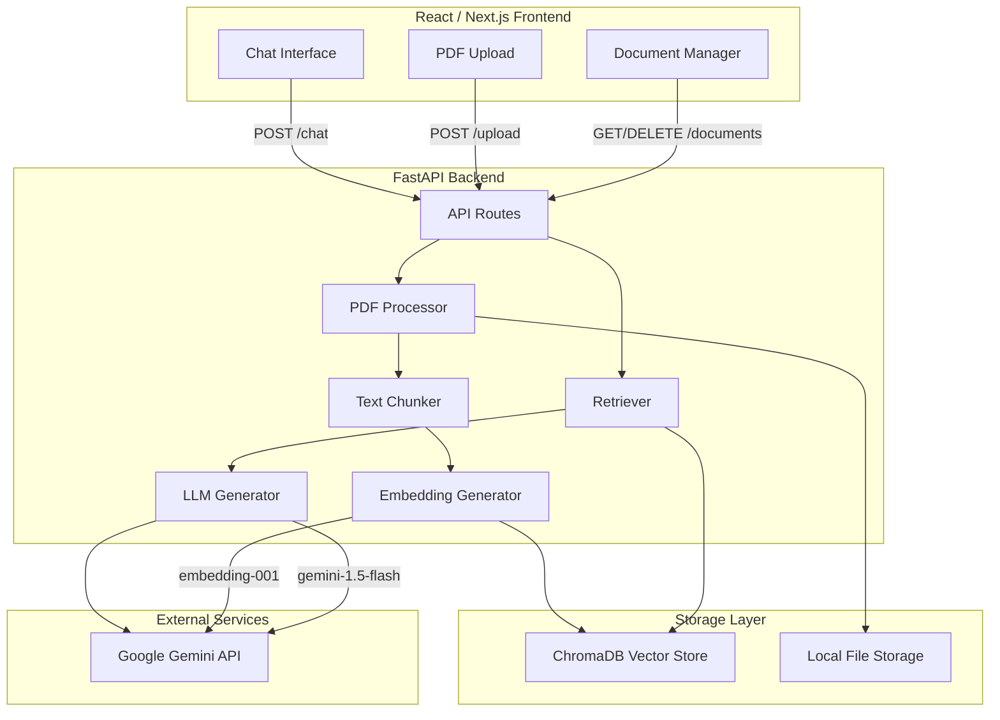
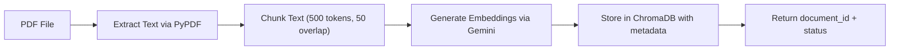
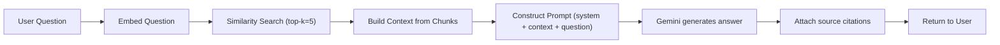

# RAG Multi-Document Chatbot - Implementation Plan

## Architecture Overview




## Data Flow: Upload Pipeline




## Data Flow: Query Pipeline




## Project Structure

```
Chatbot_project/
├── backend/
│   ├── app/
│   │   ├── main.py              # FastAPI app entry point
│   │   ├── config.py            # Settings & env vars
│   │   ├── routes/
│   │   │   ├── chat.py          # POST /chat
│   │   │   ├── documents.py     # Upload, list, delete documents
│   │   │   └── summarize.py     # POST /summarize
│   │   ├── services/
│   │   │   ├── pdf_processor.py # PDF text extraction
│   │   │   ├── chunker.py       # Text splitting logic
│   │   │   ├── embeddings.py    # Gemini embedding wrapper
│   │   │   ├── vector_store.py  # ChromaDB operations
│   │   │   ├── retriever.py     # Similarity search + context building
│   │   │   └── llm.py           # Gemini generation wrapper
│   │   └── models/
│   │       └── schemas.py       # Pydantic request/response models
│   ├── uploads/                 # Stored PDF files
│   ├── chroma_db/               # ChromaDB persistent storage
│   ├── requirements.txt
│   ├── .env.example
│   └── README.md
├── frontend/
│   ├── src/
│   │   ├── app/
│   │   │   ├── page.tsx         # Main chat page
│   │   │   └── layout.tsx       # Root layout
│   │   ├── components/
│   │   │   ├── ChatWindow.tsx   # Message list + input
│   │   │   ├── MessageBubble.tsx# Individual message with citations
│   │   │   ├── FileUpload.tsx   # Drag-and-drop PDF uploader
│   │   │   ├── DocumentList.tsx # Sidebar: uploaded documents
│   │   │   └── SourceCard.tsx   # Citation display component
│   │   └── lib/
│   │       └── api.ts           # API client functions
│   ├── package.json
│   ├── tailwind.config.ts
│   └── next.config.js
└── README.md
```

## Tech Stack

**Backend:**

- **FastAPI** - async Python web framework
- **Google Generative AI SDK** (`google-generativeai`) - Gemini LLM + embeddings
- **ChromaDB** - lightweight vector database (no external service needed)
- **PyPDF** (`pypdf`) - PDF text extraction
- **LangChain** (`langchain`, `langchain-text-splitters`) - text chunking utilities
- **python-multipart** - file upload support
- **python-dotenv** - environment variable management

**Frontend:**

- **Next.js 14** (App Router) - React framework
- **Tailwind CSS** - styling
- **shadcn/ui** - pre-built accessible components
- **Lucide React** - icons
- **react-dropzone** - drag-and-drop file uploads

---

## Milestone 1: Project Setup and Infrastructure

**Goal:** Get both backend and frontend scaffolded and running.

Tasks:

- Initialize the project folder structure (backend + frontend)
- Create `backend/requirements.txt` with all Python dependencies
- Create `backend/.env.example` with `GOOGLE_API_KEY=your_key_here`
- Create `backend/app/config.py` using pydantic-settings to load env vars
- Create `backend/app/main.py` with FastAPI app, CORS middleware, and route registration
- Scaffold Next.js frontend with Tailwind CSS and shadcn/ui
- Verify both servers start (`uvicorn` on port 8000, Next.js on port 3000)

**Key dependency versions (backend/requirements.txt):**

```
fastapi
uvicorn[standard]
python-multipart
python-dotenv
google-generativeai
chromadb
pypdf
langchain-text-splitters
pydantic-settings
```

---

## Milestone 2: PDF Processing Pipeline

**Goal:** Accept PDF uploads, extract text, and chunk it.

Tasks:

- Build `pdf_processor.py` - extract text from uploaded PDFs page by page using `pypdf`
- Build `chunker.py` - split extracted text into overlapping chunks using `RecursiveCharacterTextSplitter` (chunk_size=500, chunk_overlap=50)
- Each chunk stores metadata: `{document_name, page_number, chunk_index}`
- Create the `POST /documents/upload` endpoint that saves the file and processes it
- Handle edge cases: encrypted PDFs, empty pages, non-text PDFs (return clear error)

**Key code concept (chunker):**

```python
from langchain_text_splitters import RecursiveCharacterTextSplitter

splitter = RecursiveCharacterTextSplitter(
    chunk_size=500,
    chunk_overlap=50,
    separators=["\n\n", "\n", ". ", " ", ""]
)
chunks = splitter.split_text(extracted_text)
```

---

## Milestone 3: Embeddings and Vector Store

**Goal:** Generate embeddings and store/retrieve them in ChromaDB.

Tasks:

- Build `embeddings.py` - wrapper around `google.generativeai.embed_content()` using model `models/embedding-001`
- Build `vector_store.py` - ChromaDB client with persistent storage at `./chroma_db/`
  - `add_document(doc_id, chunks, metadatas)` - embed and store chunks
  - `query(query_text, n_results=5)` - similarity search
  - `delete_document(doc_id)` - remove all chunks for a document
  - `list_documents()` - return unique document names
- Wire upload endpoint to embed chunks and store them after PDF processing
- Create `GET /documents` (list) and `DELETE /documents/{doc_id}` endpoints

**Key code concept (embedding):**

```python
import google.generativeai as genai

genai.configure(api_key=settings.GOOGLE_API_KEY)

def get_embedding(text: str) -> list[float]:
    result = genai.embed_content(
        model="models/embedding-001",
        content=text,
        task_type="retrieval_document"
    )
    return result['embedding']
```

---

## Milestone 4: RAG Retrieval and Generation

**Goal:** Build the core RAG pipeline - retrieve relevant chunks, construct prompt, generate answer with citations.

Tasks:

- Build `retriever.py`:
  - Accept user query, embed it (with `task_type="retrieval_query"`)
  - Run similarity search against ChromaDB (top-k=5)
  - Return ranked chunks with metadata (source doc name, page number)
- Build `llm.py`:
  - Wrapper around `genai.GenerativeModel("gemini-1.5-flash")`
  - System prompt instructs the model to: answer based on provided context only, cite sources in format `[Source: filename.pdf, Page X]`, say "I don't have enough information" when context is insufficient
  - Temperature = 0.3 for factual responses
- Build `POST /chat` endpoint:
  - Accepts `{question: str, chat_history: list}` 
  - Runs retrieval -> generation pipeline
  - Returns `{answer: str, sources: [{document, page, snippet}]}`
- Build `POST /summarize` endpoint:
  - Accepts `{document_id: str}`
  - Retrieves all chunks for that document
  - Sends to Gemini with a summarization prompt
  - Returns structured summary

**Key prompt template:**

```
You are a helpful assistant that answers questions based on the provided documents.

RULES:
- Only answer based on the provided context
- Always cite your sources using [Source: filename, Page X]
- If the context doesn't contain relevant information, say so clearly
- Be concise and accurate

CONTEXT:
{retrieved_chunks_with_metadata}

QUESTION: {user_question}
```

---

## Milestone 5: React Frontend - Chat Interface

**Goal:** Build a polished chat UI with document management.

Tasks:

- Create the main layout: sidebar (document list) + main area (chat)
- Build `ChatWindow.tsx` - scrollable message list with auto-scroll, input bar with send button
- Build `MessageBubble.tsx` - different styles for user/bot messages, render markdown in bot responses
- Build `SourceCard.tsx` - clickable citation cards showing document name, page, and snippet preview
- Build `FileUpload.tsx` - drag-and-drop zone with progress indicator, accepts only `.pdf` files
- Build `DocumentList.tsx` - sidebar listing uploaded docs with delete buttons
- Build `api.ts` - typed API client with functions: `uploadDocument()`, `sendMessage()`, `getDocuments()`, `deleteDocument()`, `summarizeDocument()`
- Wire everything together on the main page

---

## Milestone 6: Integration, Polish, and Error Handling

**Goal:** End-to-end working chatbot with good UX.

Tasks:

- Add loading states (typing indicator for bot, upload progress bar)
- Add error toasts for failed uploads, API errors, rate limits
- Add chat history support (maintain conversation context in frontend state)
- Add "New Chat" button to reset conversation
- Add document-scoped queries (optional filter: "ask only about this document")
- Add responsive design for mobile
- Write `README.md` with setup instructions, screenshots, and architecture diagram
- Create `.env.example` for both backend and frontend

---

## Milestone 7: Testing and Deployment Prep

**Goal:** Ensure reliability and document deployment options.

Tasks:

- Test with various PDF types (text-heavy, tables, multi-page, scanned*)
- Add input validation (file size limits, file type checks)
- Add rate limiting on API endpoints
- Add basic logging throughout the pipeline
- Document deployment options in README:
  - Local development setup
  - Docker Compose for containerized deployment
  - Cloud deployment guide (Railway / Render / Vercel)

*Note: Scanned/image PDFs require OCR (Tesseract) which is out of scope for MVP but can be added later.

---

## API Endpoints Summary


| Method | Endpoint              | Description                          |
| ------ | --------------------- | ------------------------------------ |
| POST   | `/documents/upload`   | Upload and process a PDF             |
| GET    | `/documents`          | List all uploaded documents          |
| DELETE | `/documents/{doc_id}` | Delete a document and its embeddings |
| POST   | `/chat`               | Ask a question (RAG pipeline)        |
| POST   | `/summarize`          | Summarize a specific document        |


---

## Environment Variables

- `GOOGLE_API_KEY` - Google AI Studio API key (get from [https://aistudio.google.com/apikey](https://aistudio.google.com/apikey))
- `CHROMA_PERSIST_DIR` - ChromaDB storage path (default: `./chroma_db`)
- `UPLOAD_DIR` - PDF file storage path (default: `./uploads`)
- `NEXT_PUBLIC_API_URL` - Backend URL for frontend (default: `http://localhost:8000`)

